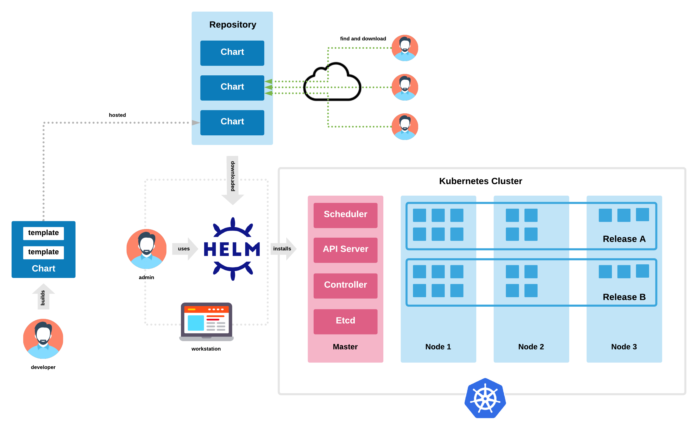

# Helm Repository Demonstration

This GitHub repo is used to demonstrate GitHub’s ability to act as a static serving web server. GitHub provides this capability through its Pages feature.

With the Pages feature enabled, you can host your own Helm charts within it, thereby making it a Helm chart repository. 



The custom ```cloudacademy-webapp``` Helm chart when installed creates the following cluster resources:


:metal:

# STEP 1:
Examine the Helm repo ```index.yaml``` chart file

```
curl -i https://cloudacademy.github.io/helm-repo/index.yaml
```

# STEP 2:
Add the CloudAcademy GitHub Pages enabled Helm repo to local Helm setup 

```
helm repo add cloudacademy-gh-repo https://cloudacademy.github.io/helm-repo/
```

# STEP 3:
List the currently configured Helm repos

```
helm repo list
```

# STEP 4:
Perform a Helm repo update

```
helm repo update
```

# STEP 5:
Search within the locally configured Helm repos for the ```cloudacademy-webapp``` Helm chart

```
helm search repo cloudacademy
```

# STEP 6:
Install the ```cloudacademy-gh-repo/cloudacademy-webapp``` Helm chart

```
helm install ca-demo2 cloudacademy-gh-repo/cloudacademy-webapp
```

# STEP 7:
Perform an HTTP GET request, send it to the newly created cluster service and confirm that the response containse the ```CloudAcademy DevOps 2020 v1``` message stored in the ```values.yaml``` file

```
kubectl run --image=busybox bbox1 --rm -it --restart=Never \
-- /bin/sh -c "wget -qO- http://ca-demo2-cloudacademy-webapp"
```